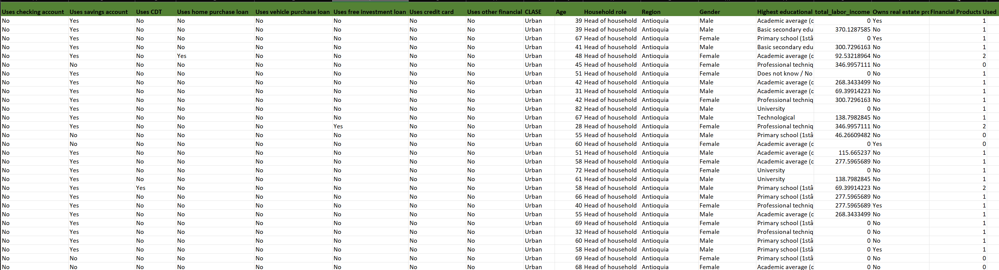
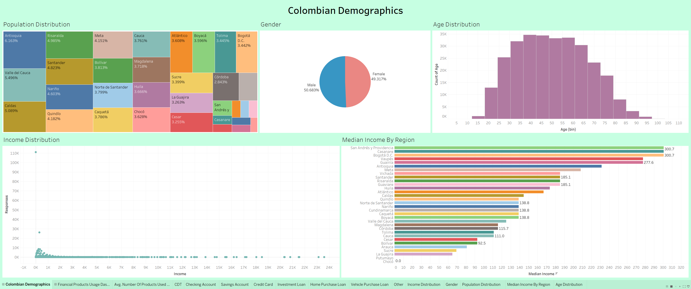
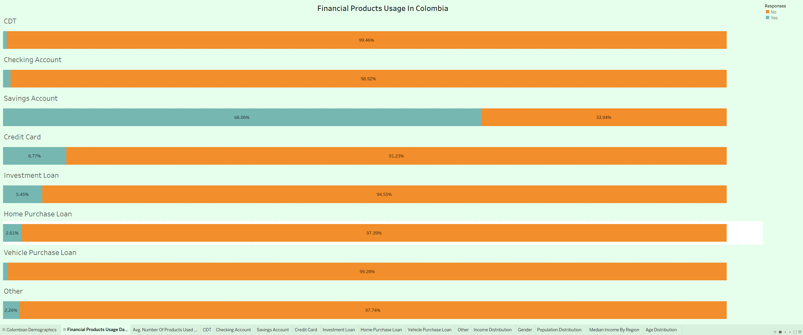
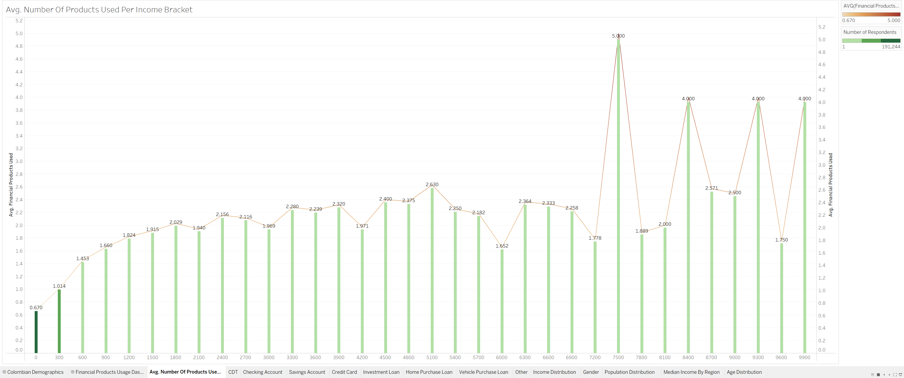

# DataKind: Financial Inclusion In Colombia 

# Introduction

Colombia is one of the most well-known countries in the world. Few are the nations that can match the quality of its coffee or its biodiversity. Nevertheless, not much is known about its financial products, particularly the amount of access that its citizens have to these products. This project aims to shine some light on Colombia’s financial inclusivity by focusing on the different products that are available to its citizens, as well as the level of access these have to those products. 

 
**Technologies Used:**
- Python: Data Cleaning and Preliminary Exploratory Analysis
- Tableau: Exploratory Analysis  

----
## Problem Statement
- What’s the average Colombian Financially Like?
- What are the financial products offered by Colombian Banks?
- What’s the discrepancy in access to financial products between those who earn below the median salary and those who earn above?
 
 ---- 
## Data Preparation
- Data Collection
    - The dataset used for this project was originally compiled by DANE (Departamento Administrativo Nacional De Estatística), but the current version was produced by Emilija Stanković. It is further refined to only include the head of household as part of the analysis. This data is a collection of surveys on Colombians’ financial status. It consists of 17 features and 290968 rows. Some of the features include region, sex, uses a checking account, uses a credit card, income, and so on. The file of this dataset can be found at: https://files.slack.com/files-pri/T08H10XAX9Q-F08LDB62F1P/download/dane_data.csv?origin_team=T08H10XAX9Q
- Raw Data Snapshot
    -  
- Data Cleaning
    - Data points are evaluated for correctness, data types, and overall uniformity
    - Null values are imputed and dropped when needed
    - Null values for Total Income are replaced with 0
    - Salary is converted to USD

----
## Analysis:
- Colombian Demographics
    -  

 <a href="https://public.tableau.com/views/DataKind/ColombianDemographics?:language=en-US&:sid=&:redirect=auth&:display_count=n&:origin=viz_share_link" target="_blank">View Full Graph</a>

Most Colombians are somewhat evenly spread among the different departments in their country. The distribution of their genders approximates 50/50, 50% men and 50% women. And most ages range between 19 and 79. Their median income for the head of the household in Colombia is around 300 dollars. However, this is the type of salary that only Colombians living in urban areas enjoy. Salary for Colombians living in rural areas can drop below 100 dollars even to 0 for those who live in self-sustaining farms.

- Financial Products Usage In Colombia
   -  

 <a href="https://public.tableau.com/views/DataKind/FinancialProductsUsageDashboard?:language=en-US&:sid=&:redirect=auth&:display_count=n&:origin=viz_share_link" target="_blank">View Full Graph</a>

Colombia offers 7 financial products, but most of its citizens do not use them. In fact, over 65% of Colombians (191244 out of 290968) do not use financial products. One of the reasons for this might be that Colombians tend to buy goods in cash. Moreover, many lack the resources to apply for purchasing loans or credit cards, and when they do, they opt for savings accounts as their only financial product
 
- Average Number of Products Used Per Income Bracket
  - 

 <a href="https://public.tableau.com/views/DataKind/Avg_NumberOfProductsUsePerIncomeBracket?:language=en-US&:sid=&:redirect=auth&:display_count=n&:origin=viz_share_link" target="_blank">View Full Graph</a>

Colombians whose income drops below the median tend not to get financial products. Many come to acquire one financial product when they are at or beyond the median income. Once they go past twice the median income, they are likely to get 2 financial products or more

----    
## Conclusion and Recommendations 
- Colombia is not a wealthy country where its citizens have ready access to financial products. Most citizens (around 65%) tend not to use financial products. Only citizens who meet or exceed the median income tend to acquire at least one financial product.
- For this reason, developing financial products for low-income families and bringing awareness to these is an integral part of the mainstream adoption of financial products in Colombia. This can take the form of lowering processing fees for merchants, providing incentives for low-income families for signing up for checking or savings accounts, or even providing an appealing credit card sign-up bonus

